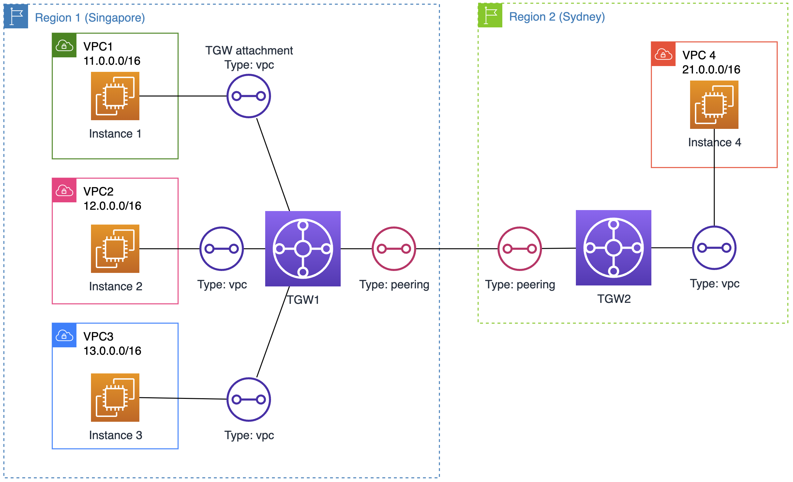

# TeachingDemos
Diagram

## Demo VPC peering
1. Launch CFN template to create 3 VPCs + 1st subnet + 1 amz linux instance in each
    - 2 in SGP (11.0.0.0/16 & 12.0.0.0/16)
    - 1 in Sydney region (21.0.0.0/16)
Note: create cfn stack in 1st region before 2nd region because IAM instance profile/role is global scope.

2. Test VPC peering
    2.1. Create VPC peering connection
    2.2. In RT of each VPC, add route to pcx targets

3. (Optional) What if we put VPC0 (make use current Bastion host in 10.0.0.0/8)

## Demo Transit GW
### Among VPCs within region

1.   Create Transit Gateway
2.   Create Transit Gateway Attachments
3.   Create Transit Gateway Route Tables (can use default)
4.   Add Transit Gateway Routes to VPC Route Tables

### Cross-region

~ connecting 2 hubs together because TGW is regional-scope

1. From a region: VPC --> Transit gateway attachments --> Create transit gateway attachment

IMPORTANT: ​Attachment type: choose “peering connection”
Once created, the peer need to accept. The peering TGW attachment’s appeared

2. Association, Routing propagation between peering TGW  (~isp side):

- Transit Gateway Route Table does NOT support propagating a peering attachment --> Add Static Route in TGW, not RT of VPC

- Mind that we still have “Transit gateway policy table” - ses dynamic routing for transit gateway peering by exchanging routing and network reachability information over inter-region connections.

3. From each VPC (~customer side): add route to TGW 

### Cross-account: use RAM

1. In Source ACC: go to any TGW --> “Sharing” tab --> Create resource share --> choose external account ID --> share

2. In Destination Acc, matched region
   a. Go to RAM --> Resource shares --> Accept
   b. Vpc4: create Transit Gateway Attachments. Check VPC4’s RT won’t see next hop TGW

3. In Source Acc: VPC --> Transit gateway attachments --> select the tgw attachment of source (step #2) and “Accept...”

4. In Acc2: with shared TGW (not created by Acc2 itself), there is NO default TGW RT of Acc2 -> only need to configure RT of related VPCs in both Acc1 and Acc2

5. MORE: create custom TGW, adjust associate, propration to create “virtual” routing.
